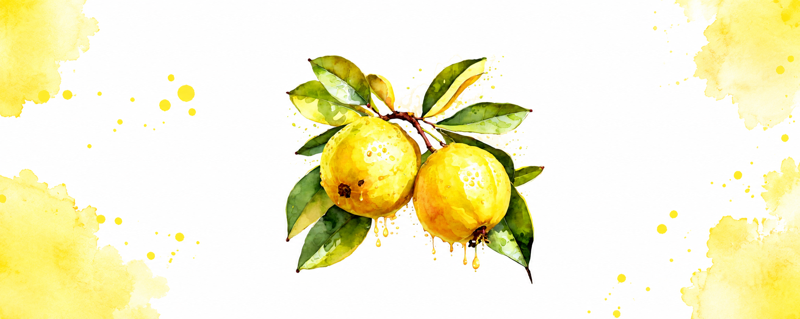

# GUVI

> ESP32-C3 autonomous smart irrigation system for smarter plant care.

## Overview

GUVI monitors:

- Soil moisture
- Temperature
- Humidity

It checks conditions every 6 hours and auto-waters when needed.

## Stack

- **Supabase** for database, auth, storage, and edge functions
- **Expo** mobile app
- **Dashboard** for monitoring and control

## Features

- Multi-user plant photo tracking
- Daily sensor logs
- Plant growth monitoring
